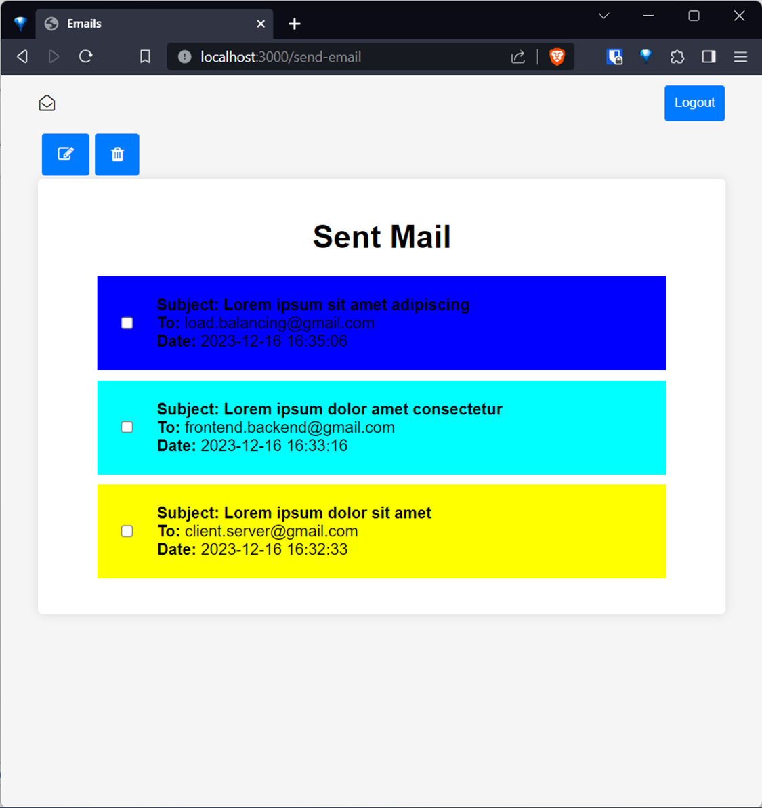

# Envelope - Email Client Application

## Table of Contents
1. [Introduction](#introduction)
   1. [Purpose](#purpose)
   2. [Key Features](#key-features)
   3. [Getting Started](#getting-started)
2. [Technical Details](#technical-details)
   1. [Overview](#overview)
   2. [Front-End Technologies](#front-end-technologies)
   3. [Back-End Technologies](#back-end-technologies)
   4. [Communication](#communication)
   5. [Flow of the Application](#flow-of-the-application)
3. [Components](#components)
   1. [Server](#server)
   2. [Client](#client)
4. [Appendix](#appendix)
   1. [Structure](#structure)
   2. [package.json](#packagejson)
   3. [myserver.json](#myserverjson)
   4. [Login.html](#loginhtml)
   5. [Outbox.html](#outboxhtml)
   6. [Compose.html](#composehtml)

## Introduction
Welcome to Envelope, a user-friendly email client application designed to streamline your email communication experience. This application boasts a simple and secure user interface, prioritizing both ease of use and the protection of your sensitive information.

### Purpose
Envelope serves as a reliable platform for sending, managing, and organizing your emails. With a focus on user convenience, the application offers a straightforward login process to get you started quickly.

### Key Features
- **Secure User Interface:** Our application prioritizes the security of your data, ensuring a safe environment for all your email-related activities.
- **Sent Email History:** Upon successful login, the application provides a comprehensive display of previously sent emails, allowing you to quickly revisit and reference past correspondence.
- **Detailed Email View:** Explore the details of any email effortlessly by simply clicking on it. This feature enables a closer examination of the content and any attachments associated with each sent email.
- **Compose New Emails:** Seamlessly create and send new emails within the application, streamlining the communication process.
- **Print Functionality:** Our application allows you to print any sent email, providing a tangible record when necessary.
- **Efficient Deletion:** Manage your sent emails efficiently by deleting them from the database either individually or in batch, ensuring a clutter-free and organized mailbox.

### Getting Started
To embark on your journey with Envelope, all you need to do is log in using your credentials. Once logged in, you'll have immediate access to your previously sent emails, and from there, you can navigate the application's intuitive features to compose new emails, view detailed email content, print, and manage your sent emails effortlessly.

## Screenshots

## Technical Details

### Overview
Envelope is a web-based email client application designed to streamline email communication. The application's technical foundation leverages HTML for the front end, providing users with an intuitive interface accessible through standard web browsers. Communication between the client and the server is facilitated by HTTP methods, including GET, POST, and DELETE requests.

### Front-End Technologies
- **HTML:** Envelope's front-end is built using HTML, ensuring a structured and user-friendly interface for efficient user interaction.
- **CSS:** Cascading Style Sheets are used to provide a beautiful user interface that is intuitive to use.
- **Client-Side JavaScript:** JavaScript is utilized on the client side to handle validation, error detection, and facilitate communication with the server. This dynamic scripting enhances user experience by enabling responsive interactions within the web browser.

### Back-End Technologies
- **JavaScript (Node.js Express):** Envelope's server-side functionality is powered by JavaScript using Node.js with the Express framework. This combination ensures effective handling of client requests and a smooth communication process.
- **Nodemailer:** Envelope integrates Nodemailer to interface with the Gmail SMTP server, enabling the secure and reliable sending of emails.
- **SQLite3 Database:** The server manages data using the SQLite3 database, employing two distinct databases:
  1. `emails.db`: Stores sent emails, allowing for efficient management of email records.
  2. `users.db`: Manages authorized users, enhancing security and access control.
- **Dotenv:** Envelope employs Dotenv to safeguard sensitive information such as usernames and passwords, ensuring confidentiality and security.

### Communication
Envelope facilitates communication between the client and server through HTTP requests. This interaction is crucial for maintaining the application's responsiveness. The client sends requests to the server for actions such as logging in, retrieving emails, composing new emails, and deleting emails. The server processes these requests and returns the appropriate response, ensuring a dynamic and interactive user experience.

### Flow of the Application
1. **Login:** Users initiate their Envelope experience by logging in through the provided login form. The client sends a POST request with the entered credentials to the server for validation.
2. **Outbox Display:** Upon successful login, the server retrieves the user's sent emails from the `emails.db` database and sends the data to the client for display. The client renders the outbox page, showcasing the sent emails in reverse chronological order.
3. **Compose Email:** Users can compose new emails by navigating to the "Compose" page, where they input recipient details, subject, and content. The client sends a POST request to the server, which processes the data and updates the `emails.db` database.
4. **Email Details:** Clicking on a specific email in the outbox triggers a request to the server to retrieve the detailed content of the selected email. The server responds with the necessary data, allowing the client to display the email details.
5. **Print Email:** Users have the option to print the contents of a selected email. Clicking the "Print" button triggers a client-side print dialog for a tangible record.
6. **Delete Email:** Users can delete individual or multiple emails by selecting the desired emails and clicking the "Delete" button. The client sends a DELETE request to the server, which updates the `emails.db` database accordingly.
7. **Logout:** Clicking the "Logout" button triggers a request to the server for logging out. The server terminates the session, and the client returns to the login page.

## Components

### Server
- **Node.js with Express:** Powers the server-side functionality, handling client requests, and managing data interactions.
- **SQLite3 Database:** Manages two databases (`emails.db` and `users.db`) to store sent emails and user credentials securely.
- **Nodemailer:** Facilitates communication with the Gmail SMTP server, ensuring reliable and secure email delivery.
- **Dotenv:** Safeguards sensitive information such as usernames and passwords.

### Client
- **HTML:** Provides the structure for the user interface, ensuring a clear and organized display of email-related activities.
- **CSS:** Enhances the visual appeal of the application, contributing to a user-friendly experience.
- **JavaScript:** Enables dynamic scripting on the client side, handling validation, error detection, and communication with the server.

## Appendix

### Structure
The project structure is organized into folders for clarity and maintainability. Key folders include:
- **`node_modules`:** Houses dependencies installed via npm.
- **`.env`:** Safely stores sensitive information such as usernames and passwords.

### package.json
This file lists the project dependencies, ensuring that developers can easily set up the required environment by running `npm install`. It also includes scripts for starting the server and running tests.

### myserver.json
Configuration file for the server, specifying details such as the port number and database filenames.

### Login.html
The login page structure, including the form for entering credentials and buttons for submitting the form or navigating to the registration page.

### Outbox.html
The outbox page structure, displaying sent emails in reverse chronological order. It includes buttons for composing new emails, deleting selected emails, and logging out.

### Compose.html
The compose page structure, featuring a form for entering recipient details, subject, and content. It includes a button for sending the email.

For more information, please read the user manual and additional technical documentation. Thank you! 